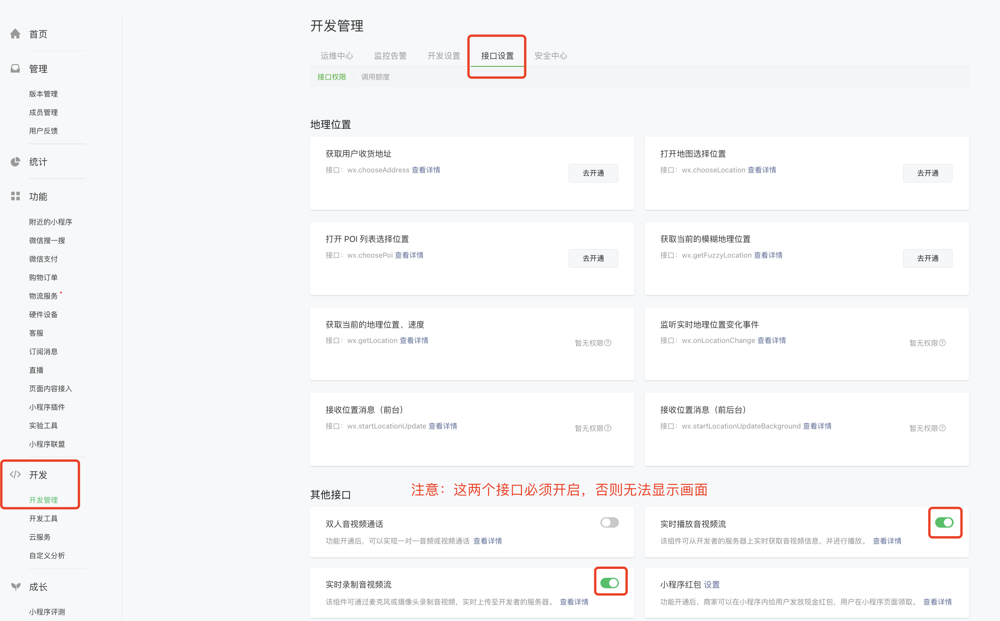

# NEMeeting 使用说明

网易会议组件小程序版

#### 1. 环境准备

- 微信 App iOS 最低版本要求：7.0.9。
- 微信 App Android 最低版本要求：7.0.8。
- 小程序基础库最低版本要求：2.10.0。
- 已安装最新版本的微信开发者工具。
- 已安装微信的移动端设备以供调试和运行体验。
- 由于微信开发者工具不支持原生组件（即 `<live-pusher>` 和 `<live-player>` 标签），需要在真机上进行运行体验。
- 由于小程序测试号不具备 `<live-pusher>` 和 `<live-player>` 的使用权限，需要申请常规小程序账号进行开发。
- 不支持 uniapp 开发环境，请使用原生小程序开发环境。

#### 2. 权限申请

在开始集成之前，请确保您已完成以下操作：
联系云信商务获取开通以下权限，并联系技术支持配置产品服务和功能

1.  通过文档[应用创建和服务开通](https://github.com/netease-kit/documents/blob/main/%E4%B8%9A%E5%8A%A1%E7%BB%84%E4%BB%B6/%E4%BC%9A%E8%AE%AE%E7%BB%84%E4%BB%B6/%E5%BA%94%E7%94%A8%E5%88%9B%E5%BB%BA%E5%92%8C%E6%9C%8D%E5%8A%A1%E5%BC%80%E9%80%9A.md)完成相关权限开通；
2.  获取对应 AppKey；

#### 3. 前提条件

1. 您已注册网易[云信账号](https://yunxin.163.com/)，并完成实名认证。

2. 出于政策和合规的考虑，微信暂未放开所有小程序对实时音视频功能（即`<live-pusher>` 和 `<live-player>`标签）的支持：

- 小程序推拉流标签不支持个人小程序，只支持企业类小程序。
- 小程序推拉流标签使用权限暂时只开放给有限 类目。
- 符合类目要求的小程序，需要在[【微信公众平台】](https://mp.weixin.qq.com/)>【开发】>【开发管理】>【接口设置】中自助<font color="red">开通该组件权限（实时播放音视频流和实时录制音视频流）</font>



### 集成

若需要在项目中引入呼叫组件按照以下步骤执行：

#### 1. 复制 NEMeeting 到 components 文件夹

#### 2. 添加组件到对应 page

```js
// xxx.json
{
  "usingComponents": {
    "NEMeeting": "../../components/NEMeeting/NEMeeting"
  }
}
```

#### 3. 使用组件

**仔细参考 pages/meeting/index 实现**

```html
<!-- .wxml -->
<NEMeeting
  id="meeting-component"
  bindmeetingClosed="onMeetingClosed"
  binddisconnect="onDisconnect"
  bindkicked="onKicked"
  bindleave="leaveRoom"
  bindonLoginStateChange="onLoginStateChange"
/>
```

#### 4. 组件方法

##### 4.1 获取子组件的实例对象

**selectComponent()**

您可以通过小程序提供的 this.selectComponent() 方法获取组件实例

```js
this.meetingComponent = this.selectComponent('#meeting-component')
```

**initSDK()**

初始化会议 SDK

| 参数名                 | 类型    | 是否必填 | 默认值                     | 说明                                                 |
| ---------------------- | ------- | -------- | -------------------------- | ---------------------------------------------------- |
| appKey                 | string  | 是       |                            | 云信 appKey                                          |
| debug                  | boolean | 否       | false                      | 是否开启调试模式                                     |
| baseDomain             | string  | 否       | https://roomkit.netease.im | 发起请求的 domain                                    |
| offChatRoom            | boolean | 否       | false                      | 是否关闭聊天室功能（false 为开启，true 为关闭）      |
| defaultDirectionalTags | string  | 否       | 空数组                     | 聊天室定向发送的消息接受者账号，多个账号用逗号隔开   |
| enableOrientChat       | array   | 否       | false                      | 是否开启聊天室定向发送消息模式，默认关闭             |
| neRtcServerAddresses   | object  | 否       | {}                         | RTC sdk 私有化配置                                   |
| imPrivateConf          | object  | 否       | {}                         | IM sdk 私有化配置                                    |
| isHideMute             | boolean | 否       | true                       | 小程序最小化后是否需要后台关闭音视频，默认开启       |
| enableRealtimeLog      | boolean | 否       | true                       | 是否开启实时日志上报（微信公众号后台查看），默认开启 |

```js
this.meetingComponent.initSDK({
  appKey,
  debug,
  baseDomain,
  offChatRoom,
  defaultDirectionalTags,
  enableOrientChat,
  neRtcServerAddresses,
  imPrivateConf,
  isHideMute,
  enableRealtimeLog,
})
```

##### 4.2 登录

**loginWithToken({ accountId, accountToken })**

> 注意：accountToken 后面有 2 个占位符‘==’可能复制不上，记得带上它

token 登入，建议在页面 onLoad 阶段调用。

```js
this.meetingComponent.loginWithToken(params)
```

**anonymousJoinMeeting()**

```js
this.meetingComponent.anonymousJoinMeeting()
```

##### 4.3 加入会议

**joinRoom()**

加入会议，需要先登录成功

| 参数名                              | 类型    | 是否必填 | 默认值   | 说明                                                  |
| ----------------------------------- | ------- | -------- | -------- | ----------------------------------------------------- |
| role                                | string  | 是       | "member" | 加入 NERoom 房间的默认角色,小程序暂不支持其它角色入会 |
| meetingId                           | boolean | 是       |          | 会议 ID                                               |
| nickName                            | string  | 是       |          | 入会昵称                                              |
| openCamera                          | boolean | 否       | false    | 入会是否打开摄像头                                    |
| openMicrophone                      | boolean | 否       | false    | 入会是否打开麦克风                                    |
| initialProperties                   | object  | 否       |          |                                                       |
| initialProperties.tag.value         | string  | 否       |          | 用户默认标签                                          |
| initialProperties.chatroomTag.value | object  | 否       |          | 用户聊天室标签组，需要转成字符串                      |

```js
// 聊天室标签组需要转成数组，再以字符串的形式传入
let chatroomTag = this.data.config.chatroomTag
  .split(/[,，]/)
  .filter((item) => !!item)
const initialProperties = {
  // initialProperties里的key名称不可更改，自定义属性需要跟服务端确认统一添加
  tag: {
    // 用户在会议中的标签，string格式
    value: tag,
  },
  chatroomTag: {
    // 聊天室标签组，value需要转字符串
    value: JSON.stringify(chatroomTag),
  },
}

this.meetingComponent.joinRoom({
  role,
  meetingId,
  nickName,
  openCamera,
  openMicrophone,
  initialProperties,
})
```

##### 4.4 离开及销毁

**leaveRoom()**

离开会议，组件内部会抛出 leaveRoom 事件，注意离开页面后需要执行登出，否则会出现无法入会的情况

> 第一种方法：xx.wxml 在页面上绑定组件内部抛出的 leaveRoom 事件，进行后续操作

```
// xx.wxml
<NEMeeting id="meeting-component" bindleave="leaveRoom"></NEMeeting>
```

> 第二种：直接调用组件的 leaveRoom 方法

```js
this.meetingComponent.leaveRoom()
```

**logout()**

登出，注意离开页面后需要执行登出

```
this.meetingComponent.logout()
```

**destroy()**

销毁，离开页面时进行销毁

```
this.meetingComponent.destroy()
```

##### 4.5 私有化配置

> 注：页面跳转传参注意检查私有化信息的完整性

检查 appkey，baseDomain 以及 G2 sdk 和 IM sdk 私有化配置对象，属性值要保持一致

参考 4.1 中 initSDK 方法实现，传入对应的 `appKey`，`baseDomain`，`neRtcServerAddresses`，`imPrivateConf` 参数即可，如果需要开启或者关闭其他配置项，参考初始化参数表字段进行添加。

```js
/**
 * @param param.debug 是否开启调试模式
 * @param param.appKey appKey
 * @param param.baseDomain [可选] 发起请求的domain
 * @param param.neRtcServerAddresses [可选] G2 sdk 私有化配置
 * @param param.imPrivateConf [可选] IM sdk 私有化配置
 **/
this.meetingComponent.initSDK({
  debug,
  appKey,
  baseDomain,
  neRtcServerAddresses,
  imPrivateConf,
})
```
