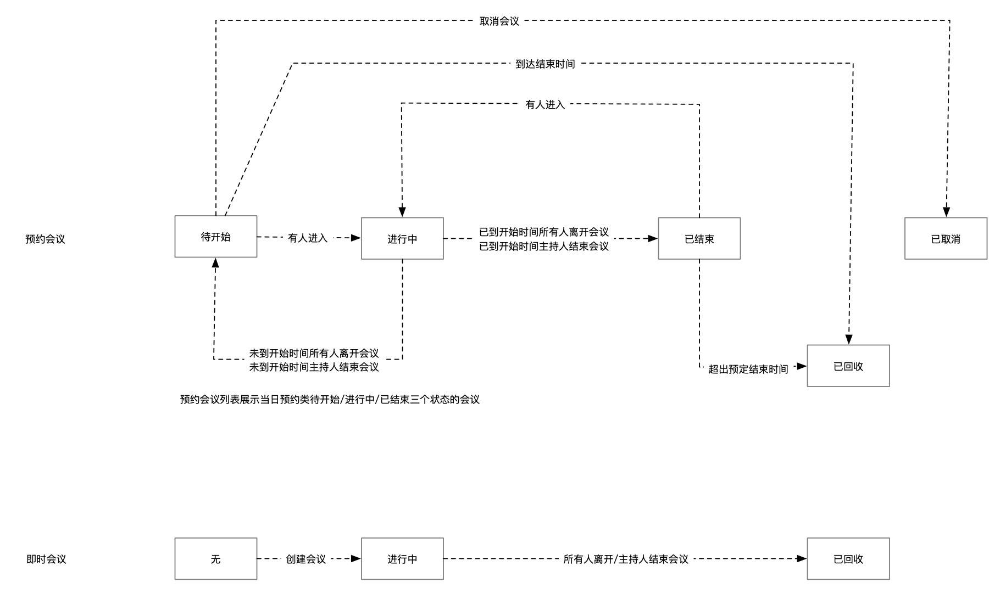

## 概述

网易会议 Rest API 是提供给开发者接入网易会议开放平台的入口。
开发者可以通过网易会议 API 进行二次开发，例如创建一个会议，获取会议信息，加入会议，结束会议，会议控制等。

## 变更记录

| 日期 | 版本 | 变更内容 |
| :------: | :------: | :------: | 
| 2020-07-14  | 0.5.0 | 初稿 |

## 准备工作

接入网易会议 Saas 服务前需要联系客服获取 AppKey

## API 网关

网关地址：https://meeting-api.netease.im


## 签名验证

Rest API对每个访问请求进行身份验证，验证失败的请求无法调用API接口。

签名用的请求头参数

| 参数 | 类型 | 必选 | 描述 |
| :------: | :------: | :------: | :------: |
| AppKey  | String | 是 | 平台分配的应用appkey |
| Nonce | String | 是 | 随机8位Integer正整数（最大长度128个字符）,例如12345678 |
| CurTime | String| 是 | 当前 UNIX 时间戳，可记录发起 API 请求的时间。例如1594639036，单位为秒。注意：如果与服务器时间相差超过1分钟，会引起签名过期错误。 |
| CheckSum | String | 是 | SHA1(AppSecret + Nonce + CurTime)，三个参数拼接的字符串，进行SHA1哈希计算，转化成16进制字符(String，小写)，注意AppSecret为AppKey对应的秘钥 [签名代码](#sign_code) |

## 公共响应参数
| 参数 | 类型 | 描述 |
| :------: | :------: | :------: |
| code  | Integer | 状态码，200：表示请求处理成功 |
| msg | String | 错误信息 |
| requestId | String | 请求流水号 |
| costTime | String | 请求响应时间，单位：毫秒 |
| ret | Object | 响应数据，业务参数都是放在这个对象内的 |

## Rest APIs

### 会议账号创建

1. 接口描述  
    注册创建一个会议账号
    
2. 接口请求地址
    ```
    POST https://{host}/v1/account/create HTTP/1.1
    Content-Type: application/json;charset=utf-8
    ```
3. 输入参数

    | 参数 | 类型 | 必选 | 描述 |
    | :------: | :------: | :------: | :------: |
    | imAccid  | String | 否 | 复用的imAccid |
    | imToken  | String | 否 | 复用的imAccid的Token |
    | shortId | String| 否 | 个人会议短号，4-8位 |

Request Body示例
```json
{
  "imAccid": "abcdefghijk",
  "imToken": "qwer1234"
}
```

4. 输出参数

    `以下是公共响应参数的ret属性内包含的参数`
    
    | 参数 | 类型 | 描述 |
    | :------: | :------: | :------: |
    | accountId | String | 会议用户账号ID |
    | accountToken | String | 会议用户账号令牌 |
    | personalMeetingId | Long | 个人会议的会议码 |
    | shortId | String | 个人会议短号 |


### 通过ImAccid查询会议账号

1. 接口描述  
   通过ImAccid查询本企业下的一个会议账号

2. 接口请求地址
    ```
    POST https://{host}/v1/account/getByImAccid HTTP/1.1
    Content-Type: application/json;charset=utf-8
    ```
3. 输入参数

   | 参数 | 类型 | 必选 | 描述 |
   | :------: | :------: | :------: | :------: |
   | imAccid  | String | 是 | imAccid |

Request Body示例
```json
{
  "imAccid": "abcdefghijk"
}
```

4. 输出参数

   `以下是公共响应参数的ret属性内包含的参数`

   | 参数 | 类型 | 描述 |
   | :------: | :------: | :------: |
   | accountId | String | 会议用户账号ID |
   | accountToken | String | 会议用户账号令牌 |
   | personalMeetingId | Long | 个人会议的会议码 |
   | shortId | String | 个人会议短号 |


### 通过AccountId查询会议账号

1. 接口描述  
   通过AccountId查询本企业下的一个会议账号

2. 接口请求地址
    ```
    POST https://{host}/v1/account/getByAccountId HTTP/1.1
    Content-Type: application/json;charset=utf-8
    ```
3. 输入参数

   | 参数 | 类型 | 必选 | 描述 |
   | :------: | :------: | :------: | :------: |
   | accountId  | String | 是 | accountId |

Request Body示例
```json
{
  "accountId": "abcdefghijk"
}
```

4. 输出参数

   `以下是公共响应参数的ret属性内包含的参数`

   | 参数 | 类型 | 描述 |
   | :------: | :------: | :------: |
   | accountId | String | 会议用户账号ID |
   | accountToken | String | 会议用户账号令牌 |
   | personalMeetingId | Long | 个人会议的会议码 |
   | shortId | String | 个人会议短号 |


### 会议账号更新令牌

1. 接口描述  
    会议账号更新令牌
    
2. 接口请求地址
    ```
    POST https://{host}/v1/account/updateToken HTTP/1.1
    Content-Type: application/json;charset=utf-8
    ```
3. 输入参数

    | 参数 | 类型 | 必选 | 描述 |
    | :------: | :------: | :------: | :------: |
    | accountId  | String | 是 | 会议用户账号 |
    | accountToken  | String | 是 | 会议用户账号令牌 |

Request Body示例
```json
{
  "accountId": "abcdefghijk",
  "accountToken": "qwer1234"
}
```

4. 输出参数
    公共响应

### 更新个人会议短号

1. 接口描述  
    更新个人会议短号
    
2. 接口请求地址
    ```
    POST https://{host}/v1/account/updateShortId HTTP/1.1
    Content-Type: application/json;charset=utf-8
    ```
3. 输入参数

    | 参数 | 类型 | 必选 | 描述 |
    | :------: | :------: | :------: | :------: |
    | accountId  | String | 是 | 会议用户账号 |
    | shortId | String | 否 | 个人会议短号，4-8位，不传表示清除短号 |

4. 输出参数
    公共响应
    
### 创建会议

1. 接口描述  
    请求创建会议。
    
2. 接口请求地址
    ```
    POST https://{host}/v2/meeting/create HTTP/1.1
    Content-Type: application/json;charset=utf-8
    ```
3. 输入参数

    | 参数 | 类型 | 必选 | 描述 |
    | :------: | :------: | :------: | :------: |
    | host | String | 是 | 会议主持人 |
    | owner | String | 否 | 会议拥有人，不填则使用host作为owner |
    | type | String | 是 | 会议类型 1 随机号即时会议; 2 个人号即时会议; 3 随机号预约会议 |
    | password | String| 否 | 会议密码，无密码为空串|
    | settings | JsonObject| 否 | 会议设置|
    | settings.controls | JsonArray | 否 | 会议控制 |
    | settings.scene.roleTypes.roleType | Integer | 否 | 场景角色，1：成员，2：主持人 |
    | settings.scene.roleTypes.maxCount | Integer | 否 | 场景角色人数上限 |
    | subject | String | 是 | 会议主题 30字符以内|
    | startTime | Long| type=3: 是; type=1: 否| 预约开始时间，毫秒|
    | endTime | Long| type=3: 是; type=1: 否| 预约结束时间，毫秒|

   `controls结构`

    | 参数 | 类型 | 必选 | 描述 |
    | :------: | :------: | :------: | :------: |
    | type | String | 是 | 控制类型，audio音频，video视频 |
    | state | Integer | 否 | 全局控制状态，1：全体关闭控制，0：取消全体关闭控制|
    | attendeeOff | Integer | 否 | 入会后自动关闭设置，0：无，1：关闭，2：关闭且不能自行操作，默认不操作|
    | allowSelfOn | Boolean | 否 | 允许自行解除关闭控制，true：允许，false：不允许，默认允许|

Request Body示例
```json
{
  "host": "abcdefghijk",
  "type": 1,
  "subject": "随机会议",
  "settings": {
    "scene": {
      "roleTypes": [
        {
          "roleType": 2,
          "maxCount": 1
        },
        {
          "roleType": 1,
          "maxCount": 1
        }
      ]
    },
    "controls": [
      {
        "type": "audio",
        "attendeeOff": 1
      },
      {
        "type": "video",
        "attendeeOff": 2
      }
    ]
  }
}
```

4. 输出参数

    `以下是公共响应参数的ret属性内包含的参数`
    
    | 参数 | 类型 | 描述 |
    | :------: | :------: | :------: |
    | meetingUniqueId | Long | 会议唯一id |
    | meetingId   | String | 随机会议码,9位数字；个人会议码，10位数字   |
    | subject | String | 预约会议主题 |
    | startTime | Long | 预约开始时间，毫秒 |
    | endTime | Long | 预约结束时间，毫秒，-1无限期 |
    | password | String | 会议密码，无密码为空串 |
    | settings | JsonObject | 会议设置 |
    | status | int| 状态，0.无效，1.未开始，2.进行中，3.已终止，4.已取消，5.已回收 |
    | shortId | String | 会议短号   |
   | settings.controls | JsonArray | 会议控制 |
   
    `controls结构`
   
   | 参数 | 类型 | 描述 |
   | :------: | :------: | :------: |
   | type | String | 控制类型，audio音频，video视频 |
   | state | Integer | 全局控制状态，1：全体关闭控制，0：取消全体关闭控制|
   | attendeeOff | Integer | 入会后自动关闭设置，0：无，1：关闭，2：关闭且不能自行操作，默认不操作|
   | allowSelfOn | Boolean | 允许自行解除关闭控制，true：允许，false：不允许，默认允许|


### 匿名入会获取会议信息

1. 接口描述  
    匿名入会获取会议信息。
    
2. 接口请求地址
    ```
    POST https://{host}/v1/meeting/anonymousJoinInfo HTTP/1.1
    Content-Type: application/json;charset=utf-8
    ```
3. 输入参数

    调用请求头
    
    |请求头|说明|必须|
    |:--- | :-------| :--- |
    | authorization| body加密值，md5(body.toJsonString()@163) | 是  |
    | clientType | Integer | 是 | 客户端类型。1：TV，2：IOS，3：AOS，4：PC，5：MAC，6：WEB，7：sip，8：linux |
    | deviceId | String | 是 | 客户端设备编号 |

    请求参数
    
    | 参数 | 类型 | 必选 | 描述 |
    | :------: | :------: | :------: | :------: |
    | meetingId  | String | 是 | 会议id |
    | nickName | String | 是 | 用户加入会议时的昵称，10位以内的汉字、字母、数字 |
    | video | Integer | 是 | 画面状态，1：打开，2：关闭 |
    | audio | Integer | 是 | 声音状态，1：打开，2：关闭 |
    | password | String | 否 | 会议密码 |
    | roleType | Integer | 否 | 用户会议角色，1.成员，4.影子 |

Request Body示例
```json
{
  "meetingId": "123456789",
  "nickName": "hello",
  "video": 1,
  "audio": 1
}
```

4. 输出参数
    
    `以下是公共响应参数的ret属性内包含的参数`

    | 参数 | 类型 | 描述 |
    | :------: | :------: | :------: |
    | code        | int    | 状态码         |
    | msg         | String | 错误信息        |
    | appKey| String | 网易会议appkey| 
    | imAppKey| String | | 
    | nrtcAppKey| String | | 
    | accountId| String | 匿名网易会议帐号id | 
    | accountToken| String | 匿名网易会议帐号密码token|
    | imAccid | String | 匿名网易会议帐号IM通信ID | 
    | imToken |String | 匿名网易会议帐号IM通信ID的密码|
    | avRoomCheckSum| String    | 音视频服务器请求token |
    | avRoomCName | String | 音视频房间名称 |
    | avRoomCid | String | 音视频房间id |
    | avRoomUid | long    | 音视频房间成员uid |
    | duration| long| 会议持续时长（单位：s）|
    | createTime| long| 会议创建时间，unix时间戳（单位：s）|
    | audioAllMute | Int    | 是否有全体禁音，0：否，1：有 |
    | chatRoomId| long| 聊天室id: 创建参数chatRoom=1时返回|
    | pushUrl | String    | 直播推流地址,为空表示改会议没有开启直播推流 |
    | meetingKey| String| 会议唯一key, 可用于获取直播参数|
    | meetingId | String| 会议号 |
    | shortId| String| 会议短号|
    | meetingUniqueId | Long | 会议唯一id|
    | sipCid | String| sip会议号|

### 查询会议（meetingUniqueId）

1. 接口描述  
    请求查询会议。
    
2. 接口请求地址
    ```
    POST https://{host}/v2/meeting/get HTTP/1.1
    Content-Type: application/json;charset=utf-8
    ```
3. 输入参数

    | 参数 | 类型 | 必选 | 描述 |
    | :------: | :------: | :------: | :------: |
    | meetingUniqueId | Long | 是 | 会议唯一id（meetingUniqueId） |

Request Body示例
```json
{
  "meetingUniqueId": 1234567890
}
```

4. 输出参数

    `以下是公共响应参数的ret属性内包含的参数`
    
    | 参数 | 类型 | 描述 |
    | :------: | :------: | :------: |
    | meetingUniqueId | Long | 会议唯一id |
    | meetingId   | String | 随机会议码,9位数字；个人会议码，10位数字   |
    | subject | String | 预约会议主题 |
    | startTime | Long | 预约开始时间，毫秒 |
    | endTime | Long | 预约结束时间，毫秒，-1无限期 |
    | password | String | 会议密码，无密码为空串 |
    | settings | JsonObject | 会议设置 |
    | status | int| 状态，0.无效，1.未开始，2.进行中，3.已终止，4.已取消，5.已回收 |
    | shortId | String | 会议短号   |
    | valid | Boolean | 会议是否可用，true：可用，false：不可用   |
    | avRoomCid |String | 音视频媒体房间id |

   `controls结构`

   | 参数 | 类型 | 描述 |
   | :------: | :------: | :------: |
   | type | String | 控制类型，audio音频，video视频 |
   | state | Integer | 全局控制状态，1：全体关闭控制，0：取消全体关闭控制|
   | attendeeOff | Integer | 入会后自动关闭设置，0：无，1：关闭，2：关闭且不能自行操作，默认不操作|
   | allowSelfOn | Boolean | 允许自行解除关闭控制，true：允许，false：不允许，默认允许|

### 修改会议

1. 接口描述  

修改预约会议。

2. 接口请求地址

```
POST https://{host}/v2/meeting/edit HTTP/1.1
Content-Type: application/json;charset=utf-8
```

3. 输入参数

|请求体参数|类型|说明|必须|
|:--- | :----- | :-------| :--- |
| meetingUniqueId | Long | 会议唯一Id | 是 |
| subject | String | 会议主题 30字符以内 | 是 |
| startTime | Long | 预约开始时间，毫秒 | 否 |
| endTime | Long | 预约结束时间，毫秒，-1无限期 | 否 |
| password | String | 会议密码，密码置空传空串 | 否 |
| settings | JsonObject | 会议设置，设置有修改要传json里全部参数 | 否 |

`controls结构`

| 参数 | 类型 | 必选 | 描述 |
| :------: | :------: | :------: | :------: |
| type | String | 是 | 控制类型，audio音频，video视频 |
| state | Integer | 否 | 全局控制状态，1：全体关闭控制，0：取消全体关闭控制|
| attendeeOff | Integer | 否 | 入会后自动关闭设置，0：无，1：关闭，2：关闭且不能自行操作，默认不操作|
| allowSelfOn | Boolean | 否 | 允许自行解除关闭控制，true：允许，false：不允许，默认允许|

Request Body示例
```json
{
  "meetingUniqueId": 1234567890,
  "subject": "新的主题"
}
```

4. 输出参数
无
 
```    
//成功结果示例
"Content-Type": "application/json; charset=utf-8"
{
  "code": 200
}

//失败结果示例
{
    "code":501,
    "msg":"服务器内部错误"
}
```

### 取消会议

1. 接口描述  

取消预约会议。

2. 接口请求地址

```
POST https://{host}/v2/meeting/cancel HTTP/1.1
Content-Type: application/json;charset=utf-8
```

3. 输入参数

|请求体参数|类型|说明|必须|
|:--- | :----- | :-------| :--- |
| meetingUniqueId | Long | 会议唯一Id | 是 |

Request Body示例

```json
{
  "meetingUniqueId": 110119120
}
```

4. 输出参数
无

```    
//成功结果示例
"Content-Type": "application/json; charset=utf-8"
{
  "code": 200
}

//失败结果示例
{
    "code":501,
    "msg":"服务器内部错误"
}
```
### 用会议唯一id结束会议

1. 接口描述

用会议唯一id结束会议

2. 接口请求地址

```
POST https:/${domain}/v2/meeting/deleteByMeetingUniqueId HTTP/1.1
Content-Type: application/json;charset=utf-8
```

3. 输入参数

|请求体参数|类型|说明|必须|
|:--- | :----- | :-------| :--- |
| meetingUniqueId | Long | 会议唯一Id | 是 |
| recycle | Boolean | 是否回收，默认不回收 | 否 |

Request Body示例

```json
{
  "meetingUniqueId": 110119120
}
```

4. 输出参数
   无

```    
//成功结果示例
"Content-Type": "application/json; charset=utf-8"
{
  "code": 200
}

//失败结果示例
{
    "code":501,
    "msg":"服务器内部错误"
}
```
### 用会议号结束会议

1. 接口描述

用会议号结束会议

2. 接口请求地址

```
POST https:/${domain}/v2/meeting/deleteByMeetingId HTTP/1.1
Content-Type: application/json;charset=utf-8
```

3. 输入参数

|请求体参数|类型|说明|必须|
|:--- | :----- | :-------| :--- |
| meetingId | String | 会议号 | 是 |
| recycle | Boolean | 是否回收，默认不回收 | 否 |

Request Body示例

```json
{
  "meetingId": "1234567890"
}
```

4. 输出参数
   无

```    
//成功结果示例
"Content-Type": "application/json; charset=utf-8"
{
  "code": 200
}

//失败结果示例
{
    "code":501,
    "msg":"服务器内部错误"
}
```

### 用会议短号结束会议

1. 接口描述

用会议短号结束会议

2. 接口请求地址

```
POST https:/${domain}/v2/meeting/deleteByMeetingShortId HTTP/1.1
Content-Type: application/json;charset=utf-8
```

3. 输入参数

|请求体参数|类型|说明|必须|
|:--- | :----- | :-------| :--- |
| shortId | String | 会议短号 | 是 |
| recycle | Boolean | 是否回收，默认不回收 | 否 |

Request Body示例

```json
{
  "shortId": "10000"
}
```

4. 输出参数
   无

```    
//成功结果示例
"Content-Type": "application/json; charset=utf-8"
{
  "code": 200
}

//失败结果示例
{
    "code":501,
    "msg":"服务器内部错误"
}
```

### 会议录像列表

1. 接口描述

获取会议录像列表。

2. 接口请求地址

```
POST https://{host}/v2/meeting/record/list HTTP/1.1
Content-Type: application/json;charset=utf-8
```

3. 输入参数

|请求体参数|类型|说明|必须|
|:--- | :----- | :-------| :--- |
| meetingUniqueId | Long | 会议唯一Id | 是 |

Request Body示例

```json
{
  "meetingUniqueId": 110119120
}
```

4. 输出参数

   `以下是公共响应参数的ret属性内包含的参数`

   | 参数 | 类型 | 描述 |
   | :------: | :------: | :------: |
   | fileInfo | JsonObject | 录制文件信息 |
   | accountId | String | 用户id |
   | filename | String | 文件名 |
   | md5 | String | 文件的md5值 |
   | size | Long | 文件大小，单位为字符，可转为Long值 |
   | type | String | 文件的类型（扩展名），包括：实时音频录制文件(aac)、白板录制文件(gz)、实时视频录制文件(mp4)、互动直播视频录制文件(flv) |
   | url | String | 文件的下载地址 |
   | mix | Integer | 是否为混合录制文件，1：混合录制文件；2：单人录制文件 |
   | pieceIndex | Integer | 录制文件的切片索引，如果单通通话录制时长超过切片时长，则录制文件会被且被切割成多个文件 |

```    
//成功结果示例
"Content-Type": "application/json; charset=utf-8"

{
    "code": 200,
    "ret": [
        {
            "filename": "0-1234-0-mix.aac",
            "md5": "xxxxxx",
            "size": 12345667,
            "type": "aac",
            "url": "http://xiazai.vod.126.net/xiazai/0-1234-0-mix.aac",
            "mix": 1,
            "pieceIndex": 0
        },
        {
            "filename": "0-1234-0-mix.mp4",
            "md5": "xxxx",
            "size": 12345677,
            "type": "mp4",
            "url": "http://xiazai.vod.126.net/xiazai/0-1234-0-mix.mp4",
            "mix": 1,
            "pieceIndex": 0
        }
    ],
    "requestId": "mc_932241123450",
    "costTime": "406ms"
}

//失败结果示例
{
    "code":501,
    "msg":"服务器内部错误"
}
```

### 查询可用的会议列表

1. 接口描述  
   查询可用的会议列表。

2. 接口请求地址
    ```
    POST https://{host}/v2/meeting/list HTTP/1.1
    Content-Type: application/json;charset=utf-8
    ```
3. 输入参数

   | 参数 | 类型 | 必选 | 描述 |
   | :------: | :------: | :------: | :------: |
   | meetingUniqueId | Long | 否 | 会议唯一id（meetingUniqueId） |
   | meetingId | String | 否 | 会议号 |
   | minStartTime | Long | 否 | 最小会议开始时间，毫秒 |
   | maxStartTime | Long | 否 | 最大会议开始时间，毫秒 |
   | statusList | List<Integer> | 否 | 状态列表，会议状态，1.未开始，2.进行中 |
   | type | String | 否 | 会议类型 1 随机号即时会议; 2 个人号即时会议; 3 随机号预约会议 |
   | pageIndex | int | 否 | 分页页码，从0开始，默认0 |
   | pageSize | int | 否 | 分页大小，1-100，最大100，默认20 |

Request Body示例
```json
{
  "pageIndex": 0,
  "pageSize": 20
}
```

4. 输出参数

   `以下是公共响应参数的ret属性内包含的参数`

   | 参数 | 类型 | 描述 |
   | :------: | :------: | :------: |
   | pageIndex | int | 分页页码，从0开始 |
   | pageSize | int | 分页大小，1-100，最大100 |
   | totalNum | long | 总数量 |
   | totalPages | int | 总页数 |
   | meetingUniqueId | Long | 会议唯一id |
   | meetingId   | String | 随机会议码,9位数字；个人会议码，10位数字   |
   | subject | String | 预约会议主题 |
   | startTime | Long | 预约开始时间，毫秒 |
   | endTime | Long | 预约结束时间，毫秒，-1无限期 |
   | password | String | 会议密码，无密码为空串 |
   | settings | JsonObject | 会议设置 |
   | status | int| 状态，0.无效，1.未开始，2.进行中，3.已终止，4.已取消，5.已回收 |
   | shortId | String | 会议短号   |

   `controls结构`

   | 参数 | 类型 | 描述 |
   | :------: | :------: | :------: |
   | type | String | 控制类型，audio音频，video视频 |
   | state | Integer | 全局控制状态，1：全体关闭控制，0：取消全体关闭控制|
   | attendeeOff | Integer | 入会后自动关闭设置，0：无，1：关闭，2：关闭且不能自行操作，默认不操作|
   | allowSelfOn | Boolean | 允许自行解除关闭控制，true：允许，false：不允许，默认允许|

## 错误码
| 错误码 | 说明 |
| :------: | :------: |
|300 | 非法的参数 |
|301 | 参数为空 |
|302 | 非法header |
|303 | 非法字符集参数 |
|401 | 请求未通过验证 |
|402 | 服务未开通 |
|501 | 服务器内部异常 |
|510 | 请求过于频繁 |
|512 | 服务繁忙 |
|652 | 直播设置错误 |
|701 | 匿名账号分配失败，稍后重试 |
|1000 | 分配帐号失败 |
|1003 | 手机号已被注册 |
|1004 | 该手机号未注册 |
|1005 | 登录验证失效,请重新登录 |
|1006 | 验证码错误，请重新输入 |
|1007 | 密码错误，请重新输入 |
|1008 | 原密码错误，请重新输入 |
|1009 | TV帐号不存在 |
|1010 | 请输入正确的手机号 |
|1011 | 获取验证码次数超过限制 |
|1012 | 验证码失效，请重新获取 |
|1013 | IM帐号已下线 |
|1014 | 帐号不存在 |
|1015 | 验证码获取频繁，请稍后再试 |
|1016 | 注册超时，请重新操作 |
|1017 | 更改密码超时，请重新操作 |
|1019 | 会议帐号已被创建 |
|1021 | IM未绑定 |
|2000 | 该会议不存在 |
|2001 | 会议已达人数上限 |
|2002 | 该会议已在进行中 |
|2003 | 昵称格式不正确 |
|2004 | 成员视频状态错误 |
|2005 | 成员音频状态错误 |
|2007 | 该用户未拥有会议码 |
|2009 | 已达屏幕共享人数上限 |
|2010 | 会议被锁定 |
|2011 | 会议id已被占用 |
|2012 | 会议直播配置不存在 |
|2014 | 会议密码错误 |
|2015 | 同一账号并发入会错误 |
|2017 | 会议主题格式错误 |
|2018 | 请输入会议密码 |
|2021 | 会议已结束 |
|2022 | 个人会议号未设置 |
|2023 | 非法会议类型 |
|2024 | 会议已存在 |
|2025 | 会议信息不能被修改 |
|2100 | 没有主持人权限 |
|2101 | 该成员未在会议中 |
|2102 | 会控码错误 |
|2103 | 已被主持人关闭画面，无法自行打开 |
|2104 | 该成员连接不稳定，请稍后再试 |
|2105 | 没有权限 |
|3001 | 客户端类型错误 |
|3003 | 功能不支持 |
|4000 | 企业会议服务已到期 |
|4001 | 该应用已达并发上限 |

## 会议状态机



### MeetingStatus
```java
public enum MeetingStatus {

    NOT_START(1, "未开始"),

    IN_MEETING(2, "进行中"),

    ENDED(3, "已终止"),

    CANCELED(4, "已取消"),

    RECYCLED(5, "已回收"),
}
```

## 消息抄送

#### 请求说明

```
POST {callbackUrl} HTTP/1.1
Content-Type: application/json;charset=utf-8
```

|请求头|说明|必须|
|:--- | :-------| :--- |
| AppKey| 开发者平台分配的appkey| 是 |
| Nonce| 随机串 | 是 |
| CheckSum| 校验和 | 是 |
| CurTime| 生成校验和时的当前系统时间，单位毫秒| 是 |

CheckSum生成规则： checkSum = sha1_hex_lowercase(appSecret + nonce + curTime + md5_hex_lowercase(msgStr))

#### 响应处理
##### 重发条件：httpStatusCode != 200
##### 重发频率：2秒，4秒，6秒，1小时，1小时

#### 参数说明

|请求体参数|类型|说明|必须|
|:--- | :----- | :-------| :--- |
| msgType | int | 消息类型，3会议结束回调 | 是 |
| msgBody | JsonObject | 回调内容，json object，下面是body里的字段 | 是 |

######
```java
public enum MsgTypeEnum {
    MEETING_ROOM_START(1, "会议房间开始"),
    MEETING_CANCEL(2, "会议取消且会议号回收"),
    MEETING_ROOM_END(3, "会议房间结束"),
    MEETING_RECYCLE(4, "会议回收且会议号回收"),
    MEETING_JOIN(5, "成员加入会议"),
    MEETING_LEAVE(6, "成员离开会议"),
    MEETING_RECORDING(7, "会议录制"),
}
```
###### 会议号回收
会议号回收是指随机号， 对于个人会议号没有回收，会议号回收之后对应的会议也将消失

###### 会议取消/回收
会议取消或回收后，该会议将消失，并且不再能为其打开音视频房间

###### 会议房间开始/结束
会议房间开始是指为一场还存在的会议打开一个音视频房间</br>
会议房间结束是指一场会议的音视频房间已经关闭

###### 成员加入会议
成员加入到音视频房间

###### 成员离开会议
成员离开了音视频房间

###### 会议录制
开启会议录制功能，当会议结束或者超过固定会议长度时（默认2小时），会生成会议录像视频。

##### 消息体说明
###### 公共字段
|消息体属性|类型|说明|必须|
|:--- | :-------| :--- | :--- |
| meetingUniqueId | Long | 会议记录唯一id | 是 |
| meetingId | String | 个人会议码,10位数字，若为空，则随机分配会议Id | 是 |
| shortId | String | 会议短号 | 否 |
| time | Long | 事件触发的时间，毫秒 | 是 |

###### 会议抄送
|消息体属性|类型|说明|必须|
|:--- | :-------| :--- | :--- |
| type | int | 会议类型，1.快速会议，2.个人会议，3.预约会议 | 是 |
| subject | String | 会议主题 | 是 |
| reserveStartTime | Long | 预约开始时间，毫秒 | 否 |
| reserveEndTime | Long | 预约结束时间，毫秒 | 否 |
| roomCreateTime | Long | 房间开始时间，毫秒 | 否 |
| reason | Integer | 会议结束/回收原因，1.主持人结束，2.全员退出，3.超过单次会议时间，4.服务端api结束 | 否 |

###### 会议抄送示例
```json
{
  "msgType": 3,
  "msgBody": {
    "type": 1,
    "meetingId": "4130603726",
    "meetingUniqueId": 26775,
    "subject": "DEMO",
    "reserveStartTime": 1600782488572,
    "reserveEndTime": 1600782488572,
    "time": 1600782498147,
    "reason": 1
  }
}
```

###### 成员加入会议抄送
|消息体属性|类型|说明|必须|
|:--- | :-------| :--- | :--- |
| accountId | String | 用户id | 是 |
| deviceId | String | 用户设备号 | 是 |
| roomUid | Long | 音视频房间成员uid | 是 |

###### 成员加入会议抄送示例
```json
{
  "msgType": 5,
  "msgBody": {
    "accountId": "146558916040335360",
    "deviceId": "95876217-bd4d-4d40-abd2-01ae2b56ae9c",
    "roomUid": 162123717474551,
    "meetingId": "1122334455",
    "meetingUniqueId": 112211,
    "time": 1605857677012
  }
}
```

###### 成员离开会议抄送
|消息体属性|类型|说明|必须|
|:--- | :-------| :--- | :--- |
| accountId | String | 用户id | 是 |
| deviceId | String | 用户设备号 | 是 |
| roomUid | Long | 音视频房间成员uid | 是 |

###### 成员离开会议抄送示例
```json
{
  "msgType": 6,
  "msgBody": {
    "accountId": "146558916040335360",
    "deviceId": "95876217-bd4d-4d40-abd2-01ae2b56ae9c",
    "roomUid": 162123717474551,
    "meetingId": "1122334455",
    "meetingUniqueId": 112211,
    "time": 1605857677012
  }
}
```

###### 会议录制抄送
|消息体属性|类型|说明|必须|
|:--- | :-------| :--- | :--- |
| fileInfo | JsonObject | 录制文件信息 | 是 |
| accountId | String | 用户id | 否 |
| filename | String | 文件名 | 是 |
| md5 | String | 文件的md5值 | 是 |
| size | Long | 文件大小，单位为字符，可转为Long值 | 是 |
| type | String | 文件的类型（扩展名），包括：实时音频录制文件(aac)、白板录制文件(gz)、实时视频录制文件(mp4)、互动直播视频录制文件(flv) | 是 |
| url | String | 文件的下载地址 | 是 |
| mix | Integer | 是否为混合录制文件，1：混合录制文件；2：单人录制文件 | 是 |
| pieceIndex | Integer | 录制文件的切片索引，如果单通通话录制时长超过切片时长，则录制文件会被且被切割成多个文件 | 是 |

###### 会议录制抄送示例
```json
{
  "msgType": 7,
  "msgBody": {
    "fileInfo": {
      "accountId": "12345678",
      "filename": "1234-0.mp4",
      "md5": "xxxxxxxx",
      "size": 250224434,
      "type": "mp4",
      "url": "http://xiazai.vod.126.net/xxxx/1234-0.mp4",
      "mix": 2,
      "pieceIndex": 0
    },
    "meetingId": "1122334455",
    "meetingUniqueId": 112211,
    "time": 1605857677012
  }
}
```

## 签名代码Demo

<span id="sign_code" />

```java

import org.slf4j.Logger;
import org.slf4j.LoggerFactory;

import java.nio.charset.StandardCharsets;
import java.security.MessageDigest;
import java.security.NoSuchAlgorithmException;

public class CheckSumBuilder {
    private static final Logger logger = LoggerFactory.getLogger(CheckSumBuilder.class);

    private static final char[] HEX_DIGITS = { '0', '1', '2', '3', '4', '5',
            '6', '7', '8', '9', 'a', 'b', 'c', 'd', 'e', 'f' };

    public static String getCheckSum(String nonce, String curTime, String appSecret) {
        String plaintext = appSecret + nonce + curTime;
        return encode(plaintext, "SHA1");
    }

    public static String getCheckSum(String nonce, String curTime, String appSecret, String data) {
        String plaintext = appSecret + nonce + curTime + data;
        return encode(plaintext, "SHA1");
    }

    // 计算并获取md5值
    public static String getMD5(String requestBody) {
        return encode(requestBody, "md5");
    }

    private static String encode(String plaintext, String method) {
        try {
            MessageDigest messageDigest = MessageDigest.getInstance(method);
            messageDigest.update(plaintext.getBytes(StandardCharsets.UTF_8));
            return getFormattedText(messageDigest.digest());
        } catch (NoSuchAlgorithmException e) {
            logger.error("Encode error {} msg {}", plaintext, e.getMessage());
        }

        return "";
    }

    /**
     * Takes the raw bytes from the digest and formats them correct.
     *
     * @param bytes
     *            the raw bytes from the digest.
     * @return the formatted bytes.
     */
    protected static String getFormattedText(byte[] bytes) {
        int len = bytes.length;
        StringBuilder buf = new StringBuilder(len * 2);
        // 把密文转换成十六进制的字符串形式
        for (byte aByte : bytes) {
            buf.append(HEX_DIGITS[(aByte >> 4) & 0x0f]);
            buf.append(HEX_DIGITS[aByte & 0x0f]);
        }
        return buf.toString();
    }
}

```
