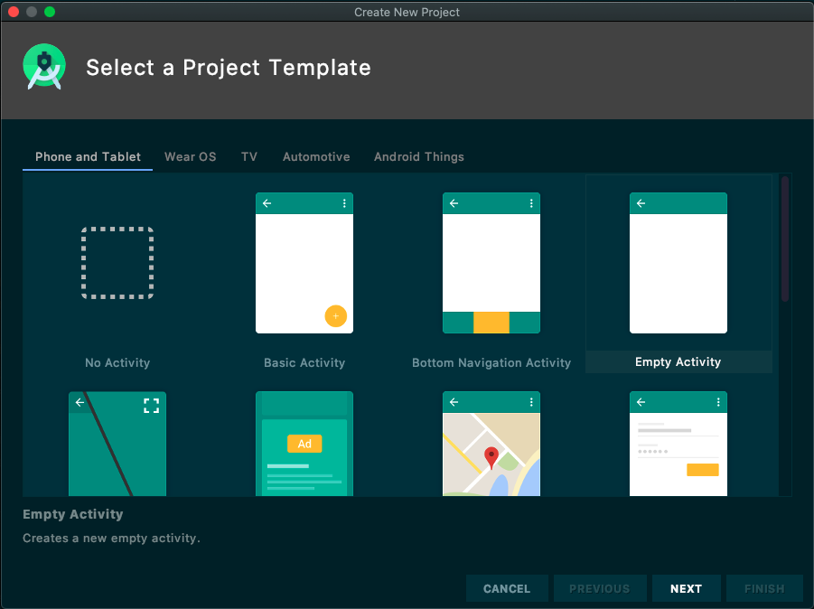
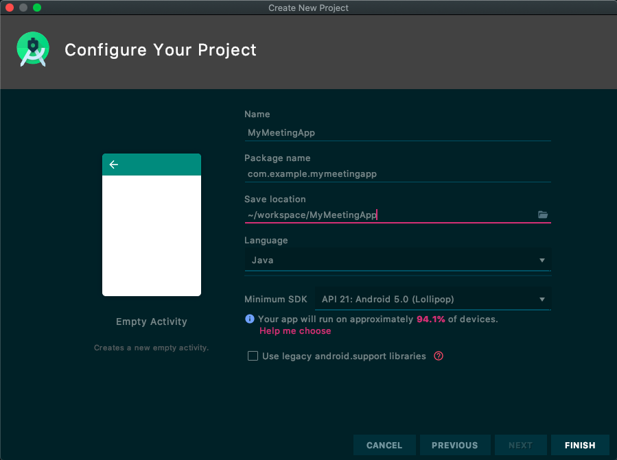

## 概述

网易会议TV SDK提供了一套简单易用的接口，允许开发者通过调用NEMeeting SDK(以下简称SDK)提供的API，快速地集成音视频会议功能至现有TV应用中。

## 变更记录

| 日期 | 版本 | 变更内容 |
| :------: | :------: | :------ |
| 2020-09-22  | 1.0.0 | 首次正式发布 |


## 快速接入

#### 开发环境准备

| 名称 | 要求 |
| :------ | :------ |
| JDK版本  | >1.8.0 |
| 最小Android API 版本 | API 21, Android 5.0 |
| CPU架构支持 | ARM64、ARMV7 |
| IDE | Android Studio |

#### SDK快速接入

1. 新建Android工程

    a. 运行Android Sudio，顶部菜单依次选择“File -> New -> New Project...”新建工程，选择'Phone and Tablet' -> 'Empty Activity' 单击Next。
    
    
    b. 配置工程相关信息，请注意Minimum API Level为API 21。
    
    
    c. 单击'Finish'完成工程创建。

2. 添加SDK编译依赖

    修改工程目录下的'app/build.gradle'文件，添加网易会议SDK的依赖。
    ```groovy
    dependencies {
      //声明SDK依赖，版本可根据实际需要修改
      implementation 'com.netease.yunxin:meetinglib:1.2.0'
    }
    ```
    之后通过顶部菜单'Build -> Make Project'构建工程，触发依赖下载，完成后即可在代码中引入SDK中的类和方法。

3. 权限处理

    网易会议SDK正常工作需要应用获取以下权限
    ```xml
    <!-- 网络相关 -->
    <uses-permission android:name="android.permission.INTERNET" />
    <uses-permission android:name="android.permission.ACCESS_NETWORK_STATE" />
    <uses-permission android:name="android.permission.ACCESS_WIFI_STATE" />
    <uses-permission android:name="android.permission.CHANGE_WIFI_STATE" />

    <!-- 读写外部存储 -->
    <uses-permission android:name="android.permission.READ_EXTERNAL_STORAGE" />
    <uses-permission android:name="android.permission.WRITE_EXTERNAL_STORAGE" />

    <!-- 多媒体 -->
    <uses-permission android:name="android.permission.READ_PHONE_STATE" />
    <uses-permission android:name="android.permission.CAMERA" />
    <uses-permission android:name="android.permission.RECORD_AUDIO" />

    <uses-permission android:name="android.permission.FOREGROUND_SERVICE" />
    ```
    以上权限已经在SDK内部进行声明，开发者可以不用在```AndroidManifest.xml```文件中重新声明这些权限，但运行时的权限申请需要应用开发者自己编码实现，可在应用首页中统一申请，详情可参考[Android运行时权限申请示例](https://developer.android.google.cn/guide/topics/permissions/overview)。如果运行时对应权限缺失，SDK可能无法正常工作，如会议时无图像、对方听不到己方声音等。

4. SDK初始化

    在使用SDK其他功能之前首先需要完成SDK初始化，初始化操作需要保证在**Application**的**onCreate**方法中执行。代码示例如下：
    
    ```java
    public class MyApplication extends Application {

        private static final String TAG = "MyApplication";
    
        @Override
        public void onCreate() {
            super.onCreate();
            NEMeetingSDKConfig config = new NEMeetingSDKConfig();
            config.appKey = Constants.APPKEY;
            NEMeetingSDK.getInstance().initialize(this, config);
        }
    }
    ```

5. 调用相关接口完成特定功能，详情请参考API文档。

- 登录鉴权
    ```java
    NEMeetingSDK.getInstance().login(String accountId, String accountToken);
    ```

- 添加/移除状态监听
    ```java
    NEMeetingSDK.getInstance().addMeetingListener(NEMeetingListener meetingListener);    //添加监听
    NEMeetingSDK.getInstance().removeMeetingListener(NEMeetingListener meetingListener); //移除监听
    ```


## 业务开发

### 初始化

#### 描述

在使用SDK其他接口之前，首先需要完成初始化操作。

#### 业务流程

1. 配置初始化相关参数

```java
NEMeetingSDKConfig config = new NEMeetingSDKConfig();
config.appKey = Constants.APPKEY; //应用AppKey
```

2. 调用接口并进行回调处理，该接口无额外回调结果数据

```java
NEMeetingSDK.getInstance().initialize(getApplication(), config);
```

#### 注意事项

- 初始化操作需要保证在**Application**类的**onCreate**方法中执行

--------------------

### 登录鉴权

#### 描述

请求SDK进行登录鉴权，只有完成SDK登录鉴权才允许创建会议。

#### 业务流程

1. 获取登录用账号ID和Token。Token由网易会议应用服务器下发，但SDK不提供对应接口获取该信息，需要开发者自己实现。

```java
String accountId = "accountId";
String accountToken = "accountToken";
```

2. 登录并进行回调处理，该接口无额外回调结果数据

```java
NEMeetingSDK.getInstance().login(accountId, accountToken);
```

#### 注意事项

- SDK不提供账号注册机制，第三方应用集成SDK时需要为第三方应用的用户帐号绑定网易会议系统中企业管理员开通的员工帐号，第三方应用的用户帐号和企业员工帐号是1:1映射的。

--------------------

### 监听状态

#### 描述

通过注册状态回调接口，可获取到状态变更的通知。

#### 业务流程

1. 注册回调接口开始监听，并在回调方法中处理感兴趣的事件

```java
NEMeetingStatusListener listener = new NEMeetingSDK.NEMeetingListener() {
        @Override
        public void onPairCodeChange(String pairCode) {
            //配对码变更
        }

        @Override
        public void onBind(String account) {
            //遥控器绑定
        }

        @Override
        public void onUnbind() {
            //遥控器解绑
        }

        @Override
        public void onEnteringMeeting() {
            //正在进入会议
        }

        @Override
        public void onEnterMeetingSuccess() {
            //进入会议成功
        }

        @Override
        public void onEnterMeetingCancel() {
            //进入会议取消
        }

        @Override
        public void onEnterMeetingFailed(int code, String msg) {
            //进入会议失败
        }

        @Override
        public void onFailed(int errorCode) {
            //错误信息返回
        }
    };
NEMeetingSDK.getInstance().addMeetingListener(listener);
```

2. 反注册回调接口停止监听

```java
NEMeetingSDK.getInstance().removeMeetingListener(listener);
```

#### 注意事项

- 在SDK初始化成功后可以调用

--------------------

### 错误码

```
public class NEMeetingErrorCode {
        /**
         * 获取配对码异常
         */
        public final static int FAILED_FETCH_PAIR_CODE = -5;
        /**
         * IM登陆异常
         */
        public final static int FAILED_IM_LOGIN = -4;
        /**
         * SDK登陆异常
         */
        public final static int FAILED_SDK_LOGIN = -3;
        /**
         * 参数异常
         */
        public final static int FAILED_PARAM = -2;
        /**
         * 未知异常
         */
        public final static int FAILED = -1;
    }

```
--------------------

### 其他

#### 注意事项

- 由于电视硬件设备限制，目前只能支持展示一个焦点参会者的视频流，如果焦点参会者离开了会议，只有在其他人变成焦点的时候才会订阅该参会者的视频流