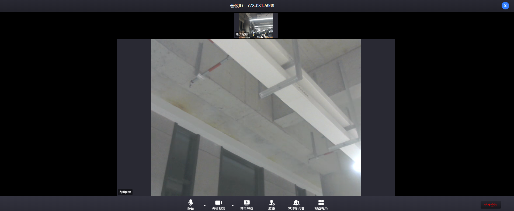

## 概述

网易会议web组件 SDK提供了一套简单易用的接口，允许开发者通过调用NEMeeting SDK(以下简称SDK)提供的API，快速地集成音视频会议功能至现有web应用中。


## 变更记录

| 日期 | 版本 | 变更内容 |
| :------: | :------: | :------- |
| 2020-09-15  | 1.0.0 | 首次正式发布，支持基础会议功能 |
| 2020-09-29  | 1.2.6 | 支持预约会议加入，修复已知bug |
| 2020-10-29  | 1.3.0 | 支持预约会议密码加入，修复已知bug |
| 2020-10-22 | 1.2.8 | 支持多端互踢，增加*NEMeetingInfo*字段
| 2020-11-12 | 1.3.1 | 增加*shortId*字段  <br>  增加两种登陆方式 *loginWithNEMeeting* *loginWithSSOToken* <br> 增加初始化配置，兼容已有方案|
| 2020-11-20 | 1.3.2 | 增加创会入会额外可选配置： *meetingIdDisplayOptions* 会议号展示逻辑 |
| 2020-11-27 | 1.3.3 | 补充关闭预约会议密码回调监听 <br> 补充创建会议提示已存在会议取消操作监听 <br> 加入会议增加预约会议密码参数*password* <br> 调整会议画廊模式展示策略 |

## 快速接入

#### 开发环境准备

| 名称 | 要求 |
| :------ | :------ |
| Chrome | 72以上 |
| Safari | 12以上 |
| Node | 8以上 |
| IE | 不支持 |
| 其他 | 未测试 |

#### SDK快速接入

1. 将代码加入到页面head中（将文件路径替换为真是存在路径）

    ```js
    <script src="./NeWebMeeting_V1.3.1.js"></script>
    ```

2. 页面添加dom

    ```js
    <div id="ne-web-meeting"></div>
    ```

3. 此时全局方法neWebMeeting已注册 在需要的执行初始化

    ```js
    neWebMeeting.actions.init(800, 800);
    ```

4. 组件已注册，接入完成，使用组件 API使用会议功能

#### API说明

1. 始化化会议组件，设置宽高

    ```js
    const config = { // 选填，仅限于私有化配置时使用
        appKey: '', //云信服务appkey
        meetingServerDomain: '' //会议服务器地址，支持私有化部署
        NIMconf: {
            // IM私有化配置项
        }
    }
    neWebMeeting.actions.init(800, 800, config)//宽，高，配置项 宽高单位是px，建议比例4：3
    ```

    **初始化如果传入了appKey和meetingServerDomain，则后续方法在非必要情况无需传入该值**

    meetingServerDomain 如果地址不带协议传，默认使用https，如果地址带协议，则根据地址协议来

    比如：传 xxx.xxx.com 则作为 https://xxx.xxx.com

    传 http://xxx.xxx.com 则使用http协议

2. 销毁WEB组件

    ```js
    neWebMeeting.actions.destory()
    ```

3. 账号登录

    ```js
    const obj = {
      accountId: '', //账号ID
      accountToken: '', //账号Token
      appkey: '', //云信服务appkey
      meetingServerDomain: '' //会议服务器地址，支持私有化部署, 为空则默认为云信线上服务器
    }
    neWebMeeting.actions.login(obj, callback)
    ```

4. 账号密码登录

    ```js
    neWebMeeting.actions.loginWithNEMeeting(account, password, callback)
    // account 账号username
    // password 密码 无需加密，内部已封装
    ```

5. SSOToken登录

    ```js
    neWebMeeting.actions.loginWithSSOToken(ssoToken, callback)
    // ssoToken 获取到的sso登陆token
    ```

6. 创建房间

    ```js
    const obj = {
      nickName: '', //人员昵称
      meetingId: '', //会议ID，如果为1则是随机会议ID，0为固定私人会议ID
      video: 1, // 1开启2关闭
      audio: 1, // 1开启2关闭
      meetingIdDisplayOptions: 0, // 0 都展示 1 展示长号，2 展示短号 默认为 0
      toolBarList: [], // 主区按钮自定义设置
      moreBarList: [], // 更多区按钮自定义排列
    }
    neWebMeeting.actions.create(obj, callback)
    ```

    关于自定义按钮详细配置可以参考[自定义按钮详细介绍](#自定义按钮详细介绍)

7. 加入房间

    ```js
    const obj = {
      nickName: '', //人员昵称
      meetingId: '', //要加入会议ID
      video: 1, // 1开启2关闭（匿名加入房间需要）
      audio: 1,  // 1开启2关闭（匿名加入房间需要）
      password: '', // 加入预约会议时可使用
      meetingIdDisplayOptions: 0, // 0 都展示 1 展示长号，2 展示短号 默认为 0
      appkey: '', //云信服务appkey（匿名加入房间需要，初始化传入则暂不需要）
      meetingServerDomain: '', //会议服务器地址，支持私有化部署, 为空则默认为云信线上服务器（匿名加入房间需要）
      toolBarList: [], // 主区按钮自定义设置
      moreBarList: [], // 更多区按钮自定义排列
    }
    neWebMeeting.actions.join(obj, callback)
    ```

    关于自定义按钮详细配置可以参考[自定义按钮详细介绍](#自定义按钮详细介绍)

8. 结束、离开会议回调

    ```js
    neWebMeeting.actions.afterLeave(callback) // 可在初始化后执行该方法进行注册
    // 成功离开会议，成功结束会议，主持人结束会议，其他端收到通知，均会触发
    ```

9. 当前页面成员信息

    ```js
    neWebMeeting.actions.memberInfo //内部属性：
    //nickName: 入会名称
    //audio: 音频状态
    //video: 视频状态
    //role: ‘host’ 主持人 'participant'、参会者 'AnonymousParticipant' 匿名参会者
    //avRoomUid: uid
    ```

10. 与会成员信息

    ```js
    neWebMeeting.actions.joinMemberInfo // 参会成员map，key是avRoomUid
    {
        avRoomUid: {
            accountId:"1158148553127790", //accoundId
            audio:1, // 音频状态
            avRoomUid:159739470024584, // uid
            extraMsg:"（主持人，我）", // 额外信息
            isActiveSpeaker:false, // 是否正在讲话
            isFocus:false, // 是否焦点视频
            isHost:true, // 是否主持人
            nickName:"txntm7o", // 入会名称
            stream:MediaStream, // 视频流
            video:2, // 视频状态
        }
    }
    ```

11. 当前会议信息

    ```js
    neWebMeeting.actions.NEMeetingInfo // 当前会议信息
    // meetingId 会议ID
    // isHost 是否主持人
    // isLocked 会议是否锁定
    // shortMeetingId 短号
    ```

12. 设置组件的宽高

    ```js
    neWebMeeting.actions.width = 100; // 设置宽度，单位px
    neWebMeeting.actions.height = 100; // 设置高度，单位px

    ```

13. 动态更新底部列表

    ```js
    var obj = {
        toolBarList: [], // 主区按钮自定义设置
        moreBarList: [], // 更多区按钮自定义排列
    }
    neWebMeeting.actions.updateCutomList(obj, callback)
    ```
    关于自定义按钮详细配置可以参考[自定义按钮详细介绍](#自定义按钮详细介绍)

#### 自定义按钮详细介绍

1. <span id="custom-introduction">自定义组件的基本结构</span>

```js
{
   "toolBarList":[
      {"id":0}, // 预置按钮
      {"id":1},
      {"id":2},
      {"id":3},
      {"id":20},
      {"id":5},
      "injectItemClick": function(btnItem) {
        // TODO
      }
   ],
   "moreBarList":[
      {
         "id":102,
         "type":"single", // 单状态按钮
         "btnConfig":{ // 单状态按钮配置-object
            "icon":"", // 图标 url地址
            "text":"哈哈哈哈少时诵诗书" // 展示文案
         },
         "visibility":0 // 可见范围
      },{
         "id":103,
         "type":"multiple", // 多状态按钮
         "btnConfig":[{ // 多状态按钮配置-数组
            "icon":"", // 图标 url地址
            "text":"我是false", // 展示文案
            "status":false // 按钮状态
         },{
            "icon":"",
            "text":"我是true",
            "status":true
         }],
         "visibility":0, // 可见范围
         "btnStatus":false, // 默认按钮状态
         "injectItemClick": function(btnItem) {
          // TODO
          // 通过调整形参的btnStatus去控制按钮状态
          btnItem.btnStatus = true;
        }
      }
   ]
}
```

2. 配置项目介绍

    | 字段 | 含义 | 类型 | 必填 | 样例 |
    | :-: | :-: | :-: | :-: | :- |
    | id | 按钮的唯一标识 <br> 非预置按钮id大于100 <br> 预置则小于等于100 | number | 是 | 0 |
    | type | 按钮类型 <br> 单状态：single <br> 多状态：multiple| string | 非预置按钮必填 | single |
    | btnConfig | 按钮配置项 <br> 单状态Object <br> 多状态Array[Object] | object\|array | 非预置按钮必填 | [参考样例](#custom-introduction) |
    | btnConfig下object | 图标url：icon（必填） <br> 图标文案：text（必填） <br> 图标状态：status（多状态按钮必填） | object | 非预置按钮必填 | [参考样例](#custom-introduction) |
    | visibility | 按钮可见范围 <br> 全局可见（**默认**）：0  <br> 主持人可见：1 <br> 非主持人可见：2 | number | 否 | 0 |
    | btnStatus | 多状态按钮展示状态配置字段 <br> 类型未限制需与btnConfig配置状态保持对应 | number\|boolean\|string | 多状态必填 | [参考样例](#custom-introduction) |
    |injectItemClick| 按钮触发回调 | function | 是 | [参考样例](#custom-introduction) |

3. 预置属性说明

    | 配置字段 | 内容(id, type) |
    | :-: | :- |
    | 预置按钮唯一值（id） | 0音频(multiple) <br> 1视频(multiple) <br> 2屏幕共享(multiple) <br> 3参会者列表(single) <br> 5画廊切换(multiple) <br> 20邀请(single) <br> 21聊天（尚未开放)<br>  |
    | 按钮可见性（visibility）| 0总是可见(默认) <br> 1主持人可见 <br> 2非主持人可见 <br> |

    | 多状态按钮 | 默认状态顺序（数组第一位与第二位） |
    | :- | :- |
    | 0 音频 | 开启，关闭 |
    | 1 视频 | 开启，关闭 |
    | 2 屏幕共享 | 结束共享，共享屏幕 |
    | 5 视图布局 | 演讲者模式，画廊模式 |

## 注意事项

- web会议组件sdk要求运行在**https**环境中
- 初始化以及单独设置宽高时，建议使用比例4：3
- 销毁意味着退出会议
- 销毁时节点不会销毁，仍保留一部分样式，但不会影响页面结构
- 初始化后用户需要执行登陆才可以进行创建和加入
- 会议的全部功能在创建或加入之后即可使用，无需其他额外配置
- 创建会议后会直接加入会议，无需执行join
- 登陆的用户在其他页面登陆、创建或加入会议，会影响目前已经加入会议的页面，造成互踢
- API方法在执行失败后，如需进行错误排查，可以通过callback输出，例：

  ```js
    const obj = {
      nickName: '', //人员昵称
      meetingId: '', //要加入会议ID
      video: 1, // 1开启2关闭（匿名加入房间需要）
      audio: 1,  // 1开启2关闭（匿名加入房间需要）
    }
    function callback(e) {
        if(e) console.log(e.name, e.message) // 有参数时证明方法异常
    }
    neWebMeeting.actions.join(obj, callback)
  ```
  
- v1.3.1更新的初始化配置，不会影响现有的appkey和meetingServerDomain的配置，如果在login传入则优先使用login配置
