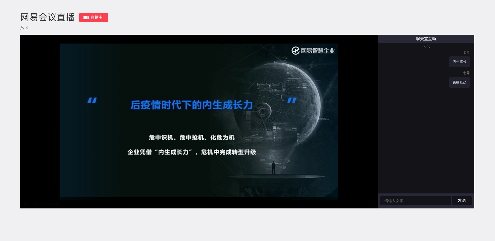

## 概述

网易会议web直播组件 SDK提供了一套简单易用的接口，允许开发者通过调用NeWebMeetingLive SDK(以下简称SDK)提供的API，快速地集成音视频会议直播功能至现有web应用中。



## 快速接入

### 开发环境准备

| 名称 | 要求 |
| :------ | :------ |
| Chrome | 72以上 |
| Safari | 12以上 |
| Node | 8以上 |
| 其他 | 待验证 |

### SDk快速接入

1. 将代码加入到页面head中（将文件路径替换为真实存在路径）

    ```html
    <script src="./NeWebMeetingLive.js"></script>
    ```

2. 页面添加dom（页面尽量不要有其他元素，直播组件默认铺满整个页面）

    ```html
    <div id="ne-web-meeting-live"></div>
    ```

3. 此时全局方法neWebMeetingLive已注册，执行登陆（登陆完成之后页面会执行初始化）

    ```js
    neWebMeetingLive.actions.login({
      appKey: '',
      meetingServerDomain: '',
      accountId: '',
      accountToken: '',
      meetingId: '',
    })
    ```

4. 登陆完成后，组件初始化，直播组件渲染完成

## API说明

1. login accountId accountToken登陆

    ```js
    const params = {
      appKey: '', // 会议appkey
      meetingServerDomain: '', // 会议服务地址，默认公有云
      cancelJoin: function() {
        // 直播输入密码点击取消回调
      },
      meetingId: '', // 会议ID
      accountToken: '',
      accountId: '',
    }
    neWebMeetingLive.actions.login(obj, (e) => {
      if (e) {
        console.error(e); // 登陆错误请参照提示或错误码
      }
    })
    ```

2. loginWithNEMeeting account password 登陆

    ```js
    const params = {
      appKey: '', // 会议appkey
      meetingServerDomain: '', // 会议服务地址，默认公有云
      cancelJoin: function() {
        // 直播输入密码点击取消回调
      },
      meetingId: '', // 会议ID
      account: '', // 账号
      password: '', // 密码
    }
    neWebMeetingLive.actions.loginWithNEMeeting(obj, (e) => {
      if (e) {
        console.error(e); // 登陆错误请参照提示或错误码
      }
    })
    ```

3. loginWithSSOToken SSOToken登陆

    ```js
    const params = {
      appKey: '', // 会议appkey
      meetingServerDomain: '', // 会议服务地址，默认公有云
      cancelJoin: function() {
        // 直播输入密码点击取消回调
      },
      meetingId: '', // 会议ID
      ssoToken: '', // ssoToken
    }
    neWebMeetingLive.actions.loginWithSSOToken(obj, (e) => {
      if (e) {
        console.error(e); // 登陆错误请参照提示或错误码
      }
    })
    ```

4. destory 销毁组件

    ```js
    neWebMeetingLive.actions.destory()
    ```

## 注意事项

* login失败的情况下，不会进行组件初始化

* 由于直播是一个较大的组件，组件默认设置铺满整个页面，且无法调整宽高，请在一个新的页面上集成组件

* 如果多个账号多次在同一页面登录，会重复销毁重新渲染当前组件，会造成不可预知的错误，请谨慎使用

* login执行的callback会返回错误码，请对照错误码文档使用

* 支持es6 import形式引入，如使用es6，请参考以下方式使用

    ```js
    import { actions } from './NeWebMeetingLive.js'
    aciotns.init();
    // or
    import neWebMeeting from './NeWebMeetingLive.js'
    neWebMeetingLive.init();
    ```
