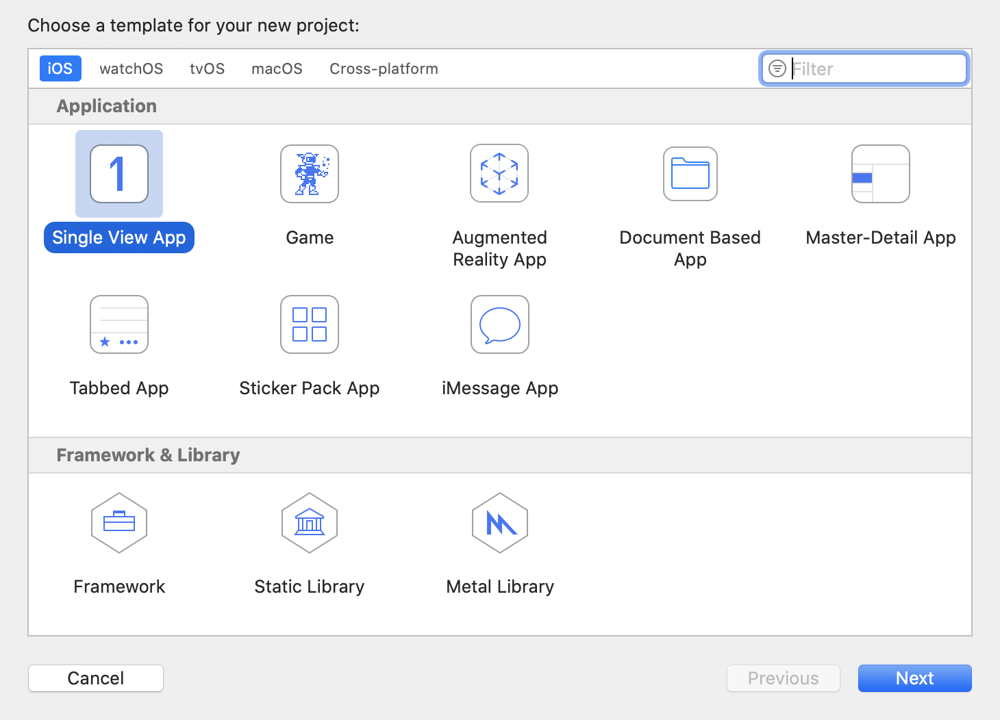
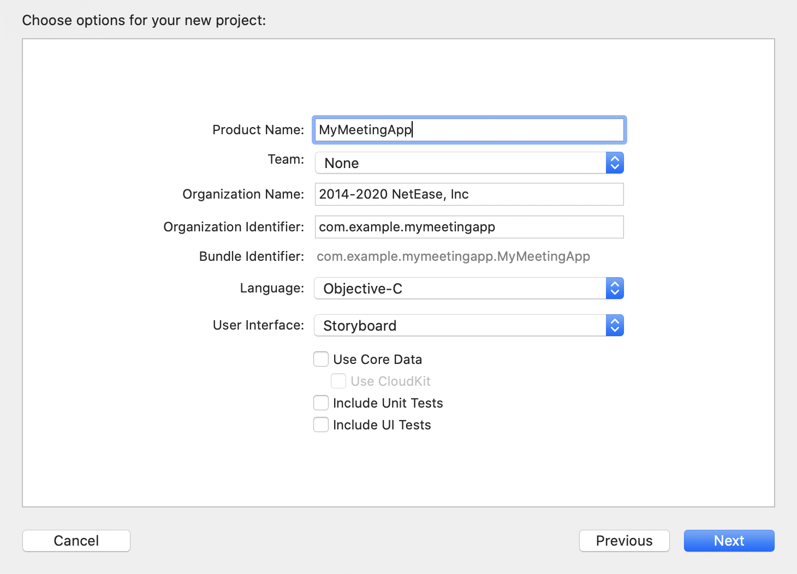
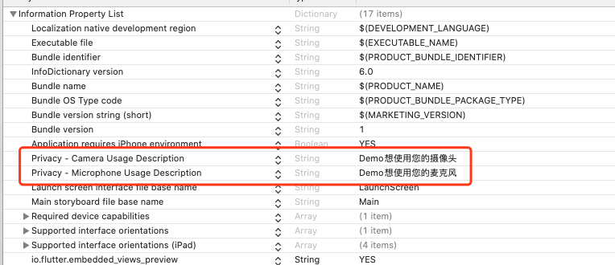

## 概述

网易会议iOS SDK提供了一套简单易用的接口，允许开发者通过调用NEMeeting SDK(以下简称SDK)提供的API，快速地集成音视频会议功能至现有iOS应用中。

## 变更记录

| 日期 | 版本 | 变更内容 |
| :------: | :------: | :------- |
| 2020-07-10  | 1.0.0 | 首次正式发布 |
| 2020-08-31 | 1.1.0 | 新增如下接口：<br />     `NEMeetingSDK#isInitialized`查询SDK初始化状态<br />     `NEMeetingService#getMeetingStatus`查询当前会议状态<br />     会议设置服务NESettingService用于保存和查询用户的相关会议选项 |
| 2020-09-04 | 1.2.0 | 新增如下接口：<br />    `NEMeetingService#getCurrentMeetingInfo` 获取当前会议信息<br />    `NEMeetingOptions#noInvite` 配置会议中是否显示"邀请"按钮<br />    `NEMeetingOptions#noChat` 配置会议中是否显示"聊天"按钮<br />    `NEMeetingOptions#injectedMoreMenuItems` <br />    "更多"菜单中的自定义注入菜单项<br />    `MeetingServiceListener增加onInjectedMenuItemClick:meetingInfo:`<br />    自定义菜单按钮点击事件回调 |
| 2020-09-18 | 1.2.3 | 新增如下接口：<br /><br />`NEJoinMeetingParams#passwork` 新增密码入会字段<br />`NEMeetingStatus#MEETING_STATUS_WAITING` 新增会议等待状态<br />`NEMeetingCode#MEETING_WAITING_VERIFY_PASSWORD` 会议等待状态类型<br />`NEMeetingInfo#password、subject、startTime、endTime`会议信息字段<br />`NEMeetingSDK#getPreMeetingService` 会议预约服务<br />`NEPreMeetingService#createScheduleMeetingItem`创建一个会议条目<br />`NEPreMeetingService#scheduleMeeting:callback:`预定会议<br />`NEPreMeetingService#cancelMeeting:callback:`取消已预定的会议<br />`NEPreMeetingService#getMeetingList:callback:`查询特定状态会议列表<br />`NEPreMeetingService#addListener:`注册会议事件回调<br />`NEPreMeetingService#removeListener`反注册会议事件回调<br />`NEScheduleMeetingListener#onScheduleMeetingStatusChange`会议状态回调 |
| 2020-09-22 | 1.2.4 | 新增遥控器服务：<br /> `NEMeetingOptions#noMinimize 配置会议中是否允许最小化会议页面<br /> `NEMeetingStatus#MEETING_STATUS_INMEETING_MINIMIZED`会议最小化状态<br />`NEMeetingSDK#getControlService` 遥控器服务<br />`NEControlService#openControlUI`打开遥控器<br /> `NEControlService#getCurrentMeetingInfo ` 获取当前会议详情。如果当前无正在进行中的会议，则回调数据对象为空<br /> `NEControlService#addListener`注册遥控器事件回调<br />`NEControlService#removeListener`反注册遥控器事件回调<br />`NEMeetingService#returnToMeeting`返回已最小化的会议页面 |

## 快速接入

#### 开发环境准备

| 名称 | 要求 |
| :------ | :------ |
| iOS版本 | 9.0以上 |
| CPU架构支持 | ARM64、ARMV7 |
| IDE | XCode |
| 其他 | CocoaPods |

#### SDK快速接入

1. 新建iOS工程

    a. 运行XCode，选择Create a new Xcode project，选择Single View App，选择Next。
    
    
    b. 配置工程相关信息，选择Next。
    
    
    c. 然后选择合适的工程本地路径，选择Create完成工程创建。

2. 通过CocoaPods集成SDK

    进入到工程路径执行pod命令，生成Podfile文件，注意CocoaPods版本使用1.9.1以上的，防止因为版本过低导致无法拉取sdk。
    ```groovy
    pod init
    ```
    打开Podfile文件添加如下代码，保存。

    ```
    pod 'NEMeetingSDK'
    ```

    执行pod命令，安装SDK

    ```
    pod install
    ```

3. 权限处理

    网易会议SDK正常工作需要摄像头、麦克风权限，用户需要在工程中的Info.list文件中配置相关的权限信息

    

    以上权限需要在进入会议之前由用户根据需要进行权限申请，权限申请的代码如下：

    ```objective-c
    //相机权限申请
    [AVCaptureDevice requestAccessForMediaType:AVMediaTypeVideo 
     								         completionHandler:^(BOOL granted) {}];
    //麦克风权限申请
    [AVCaptureDevice requestAccessForMediaType:AVMediaTypeAudio 
                             completionHandler:^(BOOL granted) {}];
    ```

4. 渲染view注册。在info.plist文件中注册平台渲染视图，保证正常渲染。

    `io.flutter.embedded_views_preview     String       YES`
    
    
    
5. SDK初始化

    在使用SDK其他功能之前首先需要完成SDK初始化，初始化操作建议在**AppDelegate.m**的**application:didFinishLaunchingWithOptions:**方法执行。代码示例如下：
    ```objective-c
        NEMeetingSDKConfig *config = [[NEMeetingSDKConfig alloc] init];
        config.appKey = [DemoConfig shareConfig].appKey;
        [[NEMeetingSDK getInstance] initialize:config
                                      callback:^(NSInteger resultCode, NSString *resultMsg, id result) {
            if (resultCode == ERROR_CODE_SUCCESS) {
                //TODO when initialize success
            } else {
                //TODO when initalize fail
            }
        }];
    ```

    **注意：其他操作一定更要等到初始化接口的回调返回之后再执行，否则会失败。**

6. 调用相关接口完成特定功能，详情请参考API文档。

- 登录鉴权
    ```objective-c
    //[NEMeetingSDK getInstance]
    - (void)login:(NSString *)account
        token:(NSString *)token
         callback:(NECallbackOnResult)callback
    ```
    
- 创建会议
    ```objective-c
    //[[NEMeetingSDK getInstance] getMeetingService]
    - (void)startMeeting:(NEStartMeetingParams *)param
                    opts:(NEStartMeetingOptions *)opts
                callback:(NECallbackOnResult)callback;
    ```
- 加入会议
    ```objective-c
    //[[NEMeetingSDK getInstance] getMeetingService]
    - (void)joinMeeting:(NEJoinMeetingParams *)param
                   opts:(NEJoinMeetingOptions *)opts
               callback:(NECallbackOnResult)callback;
    ```
- 注销登录
    ```objective-c
    //[NEMeetingSDK getInstance]
    - (void)logout:(NECallbackOnResult)callback;
    ```

## 业务开发

### 初始化

#### 描述

在使用SDK其他接口之前，首先需要完成初始化操作。

#### 业务流程

1. 配置初始化相关参数

```objective-c
NEMeetingSDKConfig *config = [[NEMeetingSDKConfig alloc] init];
config.appKey = [DemoConfig shareConfig].appKey; //应用APPKey
```

2. 调用接口并进行回调处理，该接口无额外回调结果数据

```objective-c
[[NEMeetingSDK getInstance] initialize:config
                          callback:^(NSInteger resultCode, NSString *resultMsg, id result) 
{
			if (resultCode == ERROR_CODE_SUCCESS) {
      		//初始化成功
      } else {
          //初始化失败
      }
}];
```

#### 注意事项

- 其他操作一定更要等到初始化接口的回调返回之后再执行，否则会失败

--------------------

### 登录鉴权

#### 描述

请求SDK进行登录鉴权，只有完成SDK登录鉴权才允许创建会议。

#### 业务流程

1. 获取登录用账号ID和Token。Token由网易会议应用服务器下发，但SDK不提供对应接口获取该信息，需要开发者自己实现。

```objective-c
NSString *accountId = @"accountToken";
NSString *accountToken = @"accountToken";
```

2. 登录并进行回调处理，该接口无额外回调结果数据

```objective-c
[[NEMeetingSDK getInstance] login:accountId
                            token:accountToken
                         callback:^(NSInteger resultCode, NSString *resultMsg, id result) {
      if (resultCode == ERROR_CODE_SUCCESS) {
         	//登录成功
      } else {
					//登录失败
      }
}];
```

#### 注意事项

- SDK不提供账号注册机制，第三方应用集成SDK时需要为第三方应用的用户帐号绑定网易会议系统中企业管理员开通的员工帐号，第三方应用的用户帐号和企业员工帐号是1:1映射的。

--------------------

### 创建会议

#### 描述

在已经完成SDK登录鉴权的状态下，创建并开始一个新的会议。

#### 业务流程

1. 配置创建会议用的相关参数

```objective-c
NEStartMeetingParams *params = [[NEStartMeetingParams alloc] init]; //会议参数
params.meetingId = @"123456789";    //会议号
params.displayName = @"我的会议昵称;  //会议昵称

NEStartMeetingParams params = new NEStartMeetingParams();   //会议参数
params.meetingId = "123456789";                             //会议号
params.displayName = "我的会议昵称";                          //会议昵称

NEStartMeetingOptions *options = [[NEStartMeetingOptions alloc] init]; //会议选项
options.noVideo = YES; //入会时关闭视频，默认为YES
options.noAudio = YES; //入会时关闭音频，默认为YES
```

2. 调用接口并进行回调处理。该接口无额外回调结果数据，可根据错误码判断是否成功

```objective-c
NEMeetingService *meetingServce = [NEMeetingSDK getInstance].getMeetingService;
[meetingServce startMeeting:params
                       opts:options
                   callback:^(NSInteger resultCode, NSString *resultMsg, id result) {
    if (resultCode == ERROR_CODE_SUCCESS) {
        //创建会议成功
    } else {
        //创建会议失败
    }
}];
```

3. 创建会议成功后，SDK会拉起会议界面并接管会议逻辑，开发者无需做其他处理。创会人会自动成为该会议的主持人，可进行相关的会议控制操作。其他参会者可通过该会议号加入到该会议中来。

#### 注意事项

- 创建会议时，会议号可以配置为个人会议号(登录后可通过**[NEMeetingSDK getInstance].getAccountService**获取)，或者置空(此时由服务器随机分配会议号)。
- 该接口仅支持**在登录鉴权成功后调用**，其他状态下调用不会成功

--------------------

### 加入会议

#### 描述

在已登录或未登录的状态下，加入一个当前正在进行中的会议。

#### 业务流程

1. 配置加入会议用的相关参数

```objective-c
NEJoinMeetingParams *params = [[NEJoinMeetingParams alloc] init]; //会议参数
params.meetingId = @"123456789";    //会议号
params.displayName = @"我的会议昵称;  //会议昵称

NEJoinMeetingOptions *options = [[NEJoinMeetingOptions alloc] init]; //会议选项
options.noAudio = YES;  //入会时关闭视频，默认为YES
options.noVideo = YES;  //入会时关闭音频，默认为YES
```

2. 调用接口并进行回调处理。该接口无额外回调结果数据，可根据错误码判断是否成功

```objective-c
NEMeetingService *meetingServce = [NEMeetingSDK getInstance].getMeetingService;
[meetingServce joinMeeting:params
                      opts:options
                  callback:^(NSInteger resultCode, NSString *resultMsg, id result) {
    if (resultCode == ERROR_CODE_SUCCESS) {
        //加入会议成功
    } else {
        //加入会议失败
    }
}];
```

3. 加入会议成功后，SDK会拉起会议界面并接管会议逻辑，开发者无需做其他处理。

#### 注意事项

- 会议号不能为空，需要配置为真实进行中的会议ID
- 该接口支持登录和未登录状态调用

--------------------

### 创建预约会议

#### 描述

在已登录状态下，预约一个会议

#### 业务流程

1. 创建预约会议

```objc
//获取会议预约服务
NEPreMeetingService *premeetingService = [NEMeetingSDK getInstance].getPreMeetingService;

//预定会议的Item
NEMeetingItem *item = [premeetingService createScheduleMeetingItem];
uint64_t startTimeS = [[NSDate date] timeIntervalSince1970];
item.subject = @"xxx预定的会议";        //会议主题
item.startTime = startTimeS * 1000;          //会议开始时间，单位ms
item.endTime = (startTimeS + 30*60) * 1000;  //会议结束时间，单位ms
item.password = @"123456";            //入会密码，也可以不填
NEMeetingItemSetting *setting = [[NEMeetingItemSetting alloc] init];
setting.attendeeAudioOff = NO;        //入会时打开音频开关
```

2. 调用接口并进行回调处理，可根据错误码判断是否成功

```objc
//预定会议
[premeetingService scheduleMeeting:item 
                          callback:^(NSInteger resultCode, NSString * _Nonnull resultMsg, NEMeetingItem * _Nonnull item) {
        if (resultCode == ERROR_CODE_SUCCESS) { 
            //预定成功
            //返回的item里面会更新服务端下发的只读属性（meetingUniqueId, meetingId, updateTime）
            //请以返回的item为准，替换掉之前申请的item
        } else {
						//预定失败, resultCode 参考 NEMeetingErrorCode
        }
}];
```

#### 注意事项

- 预约会议时，scheduleMeeting接口中的参数NEMeetingItem，必须是createScheduleMeetingItem返回的对象。

--------------------

### 取消预约会议

#### 描述

在已登录状态下，取消一个预约会议

#### 业务流程

```objc
//获取会议预约服务
NEPreMeetingService *premeetingService = [NEMeetingSDK getInstance].getPreMeetingService;

 //预定成功后返回的item
NEMeetingItem *item = self.item;
[preMeetingService cancelMeeting:item.meetingUniqueId 
                   callback:^(NSInteger resultCode, NSString *resultMsg) {
        if (resultCode == ERROR_CODE_SUCCESS) {
						//取消成功
        } else {
						//取消失败, resultCode 参考 NEMeetingErrorCode
        }
}];
```

#### 注意事项

- 取消预约会议的参数meetingUniqueId是服务端返回的唯一码，预约会议成功后返回的NEMeetingItem#meetingUniqueId中获取。
- 会议状态在进行中、已回收状态或者已超过结束时间，是无法取消。

--------------------

### 查询预定会议信息

#### 描述

在已登录状态下，查询一个预约会议

#### 业务流程

```objc
//获取会议预约服务
NEPreMeetingService *premeetingService = [NEMeetingSDK getInstance].getPreMeetingService;

//查询操作
[premeetingService getMeetingItemById:_item.meetingUniqueId
                             callback:^(NSInteger resultCode, 
                                        NSString * _Nonnull resultMsg, 
                                        NEMeetingItem * _Nonnull item) {
        if (resultCode == ERROR_CODE_SUCCESS) {
						//查询成功
        } else {
            //查询失败
        }
}];
```

#### 注意事项

- 查询预约会议的参数meetingUniqueId是服务端返回的唯一码，从NEMeetingItem#meetingUniqueId处获取。

--------------------

### 查询特定状态下的预定会议列表

#### 描述

在已登录状态下，查询特定状态下的预约会议列表

#### 业务流程

```objective-c
//获取会议预约服务
NEPreMeetingService *premeetingService = [NEMeetingSDK getInstance].getPreMeetingService;

//待查询状态
NSArray *meetingStatus = @[@(NEMeetingItemStatusInit),
                           @(NEMeetingItemStatusStarted),
                            @(NEMeetingItemStatusEnded)];

//查询列表
[premeetingService getMeetingList:meetingStatus
                         callback:^(NSInteger resultCode, NSString * _Nonnull resultMsg, 
                                    NSArray<NEMeetingItem *> * _Nonnull items) {
        if (resultCode == ERROR_CODE_SUCCESS) {
						//查询成功
        } else {
            //查询失败
        }
 }];
```

#### 注意事项

- 查询特定状态下的预约会议列表在时间范围上，是默认返回最近一周的。

--------------------

### 监听预约会议状态

#### 描述

通过注册会议状态回调接口，可获取到预约会议状态变更的通知。

#### 业务流程

```objc
//注册事件回调
[[NEMeetingSDK getInstance].getPreMeetingService addListener:self];

//实现回调方法
- (void)onScheduleMeetingStatusChange:(NSArray<NEMeetingItem *> *)changedMeetingItemList
                          incremental:(BOOL)incremental {
   if (incremental) {
     //进行全量更新
   } else {
     //进行增量更新
   }
}

//反注册事件回调（在不需要的时候移除，例如在dealloc方法中）
[[NEMeetingSDK getInstance].getPreMeetingService removeListener:self];
```

#### 注意事项

- 在SDK初始化成功后可以调用
- 会议状态变更回调，一次回调可能包含多个会议信息的变更

--------------------

### 监听会议状态

#### 描述

通过注册会议状态回调接口，可获取到会议状态变更的通知。

#### 业务流程

1. 注册delegate，在回调中接收会议状态。

```objective-c
//会议添加监听
[[NEMeetingSDK getInstance].getMeetingService addListener:self];

//MeetingServiceListener协议实现
- (void)onMeetingStatusChanged:(NEMeetingEvent *)event {
     //根据event处理相关业务
}
```

2. 停止接收会议状态

```objective-c
[[NEMeetingSDK getInstance].getMeetingService removeListener:self];
```

#### 注意事项

- 在SDK初始化成功后可以调用
- 1.2.2版本及以后增加了MEETING_STATUS_WAITING状态
- 1.2.4版本及以后当进入会议前配置了允许最小化会议页面，在会中最小化会议页面，通过会议状态**NEMeetingStatus#MEETING_STATUS_INMEETING_MINIMIZED**回调进行通知。若需要返回会议界面，调用接口 `[[NEMeetingSDK getInstance].getMeetingService returnToMeeting]`

--------------------

### 获取当前会议信息

#### 描述

在完成登录授权状态下，获取当前账号关联的个人会议ID

#### 业务流程

1. 确认已经通过入会方式（加入会议/创建会议/匿名入会）在会议内
2. 调用接口并进行回调处理。该接口的回调数据类型为NEMeetingInfo对象类型；如果当前无正在进行中的会议，则回调数据对象为空，错误原因请参考错误码类型。

```objective-c
 [[NEMeetingSDK getInstance].getMeetingService getCurrentMeetingInfo:^(NSInteger resultCode, NSString * _Nonnull resultMsg, NEMeetingInfo * _Nonnull info) {
    if (resultCode != ERROR_CODE_SUCCESS) {
        //查询失败
    } else {
       //查询成功
    }
}];
```

#### 注意事项

- 在SDK进入会议状态，才能获取当前会议信息

--------------------

### 获取个人会议号

#### 描述

在完成登录授权状态下，获取当前账号关联的个人会议ID。

#### 业务流程

1. 确认已完成SDK登录鉴权

2. 调用接口并进行回调处理。该接口的回调结果数据类型为字符串类型，可根据错误码判断是否成功

```objective-c
NEAccountService *accountService = [NEMeetingSDK getInstance].getAccountService;
[accountService getPersonalMeetingId:^(NSInteger resultCode, NSString *resultMsg, id result) {
    if (resultCode == ERROR_CODE_SUCCESS) {
        //获取个人会议号成功，result即为个人会议号
    } else {
        //获取个人会议号失败
    }
}];
```

3. 获取个人会议号后，可用于创建会议

#### 注意事项

- 仅在已登录状态下才会成功返回数据

--------------------

### 自定义会中【更多】菜单内容

#### 描述

在更多菜单中注入自定义选项，方便用户业务扩展。

#### 业务流程

	1. 配置匿名入会/创建会议/加入会议的Options相关参数，增加自定义列表

  ```objective-c
NEJoinMeetingOptions *options = [[NEJoinMeetingOptions alloc] init];
options.noChat = NO;
options.noInvite = NO;

//配置自定义菜单
NSMutableArray *menuItems = [NSMutableArray array];
for (int i = 0; i < 3; i++) { //最多不能超过3个，超过之后只取前3个
    NEMeetingMenuItem *item = [[NEMeetingMenuItem alloc] init];
    item.itemId = 100 + i; //必须大于100，且要保证不重复
    item.title = [@"测试Title" stringByAppendingString:@(i).stringValue];
}
options.injectedMoreMenuItems = menuItems;
  ```

2. 设置回调接口开始监听，并在回调方法中处理自定义按钮事件

```objective-c
//添加回调监听
[[NEMeetingSDK getInstance].getMeetingService addListener:self];

//实现MeetingServiceListener协议方法
- (void)onInjectedMenuItemClick:(NEMeetingMenuItem *)menuItem
                    meetingInfo:(NEMeetingInfo *)meetingInfo {
      //menuItem 是点击的item，需要用户根据itemId进行匹配
      //meetingInfo 是当前的会议状态
}

```

#### 注意事项

- 自定义会中【更多】菜单内容，需要在入会前完成设置，在会议中设置不会生效
- 默认【更多】菜单内容中的邀请和聊天，支持隐藏/显示配置
- 合法的自定义菜单项需满足以下条件：
  - itemId >= 100，且为整数Int类型
  - title不为空和空格（对空格做trim处理），且长度不大于10字符
- 会议自定义菜单项，更多菜单中最多支持添加三个自定义菜单项，如果超过三个仅显示前三个合法自定义按钮

--------------------

### 注销

#### 描述

请求SDK注销当前已登录账号，返回未登录状态。

#### 业务流程

1. 调用接口并进行回调处理。该接口无额外回调结果数据，可根据错误码判断是否成功

```objective-c
[[NEMeetingSDK getInstance] logout:^(NSInteger resultCode, NSString *resultMsg, id result) {
    if (resultCode == ERROR_CODE_SUCCESS) {
        //注销登录成功
    } else {
        //注销登录失败
    }
}];
```

#### 注意事项

- 账号注销后，登录状态被清空，不再允许创建会议

--------------------

### 使用会议设置服务

#### 描述

通过会议设置服务，可设置和查询用户的当前会议设置，如入会时的音视频开关、会议持续时间的显示等。

#### 业务流程

1. 获取会议设置服务

```objective-c
NESettingsService *settingsService = [NEMeetingSDK getInstance].getSettingsService;
```

2. 调用不同接口保存设置项或查询设置项

```objective-c
// 设置并保存会议设置
[settingsService enableShowMyMeetingElapseTime:YES];
[settingsService setTurnOnMyAudioWhenJoinMeeting:YES];
[settingsService setTurnOnMyVideoWhenJoinMeeting:YES];

//查询会议设置
BOOL showMeetingElapseTimeEnabled = [settingsService isShowMyMeetingElapseTimeEnabled];
BOOL audioEnabled = [settingsService isTurnOnMyAudioWhenJoinMeetingEnabled];
BOOL videoEnabled = [settingsService isTurnOnMyVideoWhenJoinMeetingEnabled];
```

#### 注意事项

- 针对已登录用户而言，每个用户有自己独立的一份会议设置；其他所有未登录用户、匿名用户共享一份会议设置。
- 会议设置项仅在当前设备上保存，不会漫游。
- 调用创建会议/加入会议接口时，如果接口中`NEMeetingOptions`入参为`null`，SDK会使用会议设置服务中已保存的相关配置进行创会/入会。

--------------------

### 使用遥控器服务

#### 描述

通过遥控器服务，可打开遥控器页面，和电视进行配对，也可以自定义遥控器的设置、邀请按钮。

#### 业务流程

1. 获取遥控器服务

   ```objective-c
   NEControlService *controlService = [[NEMeetingSDK getInstance] getControlService];
   ```

2. 打开遥控器

   ```objc
   //params
   NEControlParams *params = [[NEControlParams alloc] init];
   params.displayName = @"测试DisplayName";
   
   //options
   NEControlOptions *options = [[NEControlOptions alloc] init];
   
   //options - settingMenu
   NEControlMenuItem *settingItem = [[NEControlMenuItem alloc] init];
   settingItem.title = @"测试设置Item";
   options.settingMenu = settingItem;
   
   //options - shareMenu
   NEControlMenuItem *shareItem = [[NEControlMenuItem alloc] init];
   shareItem.title = @"测试分享Item";
   options.shareMenu = shareItem;
   
   //打开遥控器
   NEControlService *controlService = [[NEMeetingSDK getInstance] getControlService];
   [controlService openControlUI:params opts:options callback:^(NSInteger resultCode, NSString *resultMsg) {
       if (resultCode != ERROR_CODE_SUCCESS) {
           //打开失败
       } else {
           //打开成功
       }
   }];
   ```

3. 自定义遥控器的设置、邀请按钮

```objc
//移除遥控器事件监听
- (void)dealloc {
    [[[NEMeetingSDK getInstance] getControlService] removeListener:self];
}

//添加遥控器事件监听
- (void)viewDidLoad {
    [super viewDidLoad];
    [[[NEMeetingSDK getInstance] getControlService] addListener:self];
}

//<NEControlListener>
- (void)onInjectedSettingMenuItemClick:(NEControlMenuItem *)item
                                  info:(NEMeetingInfo *)info {
       //遥控器首页右上角设置自定义按钮菜单点击事件
}

- (void)onInjectedShareMenuItemClick:(NEControlMenuItem *)item
                                info:(NEMeetingInfo *)info {
        //遥控器会控页面邀请设置自定义按钮菜单点击事件                          
}
```


#### 注意事项

- 登陆状态下才能够使用遥控器服务
- 会中状态暂不支持开启遥控器；遥控器打开时，不支持进入会议，二者位互斥逻辑。